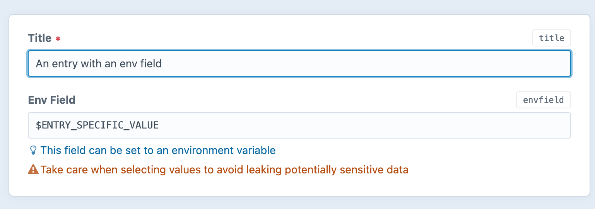
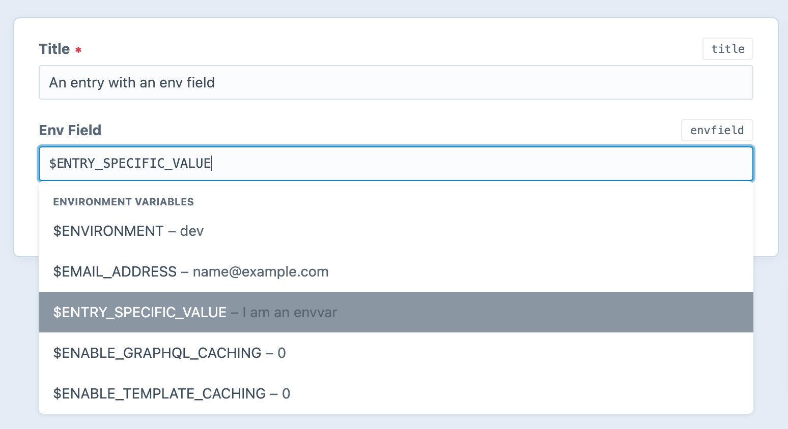

# Env Field plugin for Craft CMS 3.x

## What?

Provides a(n almost completely\*) drop-in replacement for Craft's built-in plain text field which has environment variable support, including optional autosuggest.

## Why?

Sometimes you have values that need to be managed on a per-entry basis, but which need to vary by environment (e.g. ID's in external systems / API's). This field allows you to store those ID's [in environment variables](https://12factor.net/config), and have everything work as expected when moving data between environments.





\* Multi-line plain text fields aren't supported

## Caution

Environment Variables may contain sensitive information, including passwords and API keys. This plugin was designed with a very specific use-case in mind. 

If not used carefully, the fieldtype makes it trivially easy to leak information from Environment Variables into your front end templates. Depending on the value(s) leaked, this could cause Very Bad Things To Happen.

This plugin does it's best not to help you to shoot yourself in the foot by automatically filtering the autosuggested environment variable names to remove common sensitive values that are unlikely to be used as field values in the course of normal usage (see [the config section](#config-settings) below for details), but ultimately you are responsible for your use of this plugin.

Make sure that you...

### Do:

- Use Craft's permissons and user groups to ensure that only admins / editors that know what they're doing can edit fields that use this fieldtype
- Add appropriate instructions / tips to fields (sensible, configurable defaults are provided) 
- Use this fieldtype only where it's not possible to reference environment variables statically via config files (`config/general.php` and friends)
- Check the default `excludePattern` suits your environment and adjust it if required
- Use the `includePattern` config option to clearlist environment variable names for use wherever possible

### Don't

- Be an idiot


## How?

### Requirements

This plugin requires Craft CMS 3.5 or later. It will _probably_ work with older versions, but is untested with them.

This plugin requiress PHP 7.4+

### Installation

```bash
cd /path/to/project
composer require justenoughco/craft-envfield
./craft plugin/install envfield
```

Then either create a new field or change the type of an existing Plain Text fieldto "
Environment Variable-Aware Plain Text". This _should_ be safe as all Plain Text field settings are preserved, even if they aren't available when using as an Env Field, but if converting an existing field, test outside of production first.


### Per-field settings

In addition to the built-in Plain Text fields settings, this fields allows setting:

- `Warning`: Displayed underneath the field. Defaults to a warning about about leaking sensitive information.

## Config settings

On install a `config/envfield.php` file will be created. You can use that field to adjust the following settings:

```php
[
    /* 
        Blocklist pattern 
        
        Regex used to preprocess the autosuggest list of all environment variable names to remove sensitive values

        (enabled by default)
    */
    'excludePattern' => '/^\$(CONTENT|DOCUMENT|DB|HTTP|SERVER|REDIS|GPG|SCRIPT|REMOTE|REQUEST|PHP|PHPIZE|PATH|SECURITY|FCGI)_|^\$(GATEWAY_INTERFACE|HOME|PATH|PWD|REMOTE|TERM|USER)$/i',
    /* Clearlist pattern

        Regex used to preprocess the autosuggest list of all environment variable names to allow only specific values / prefixes into the autosuggest list

        (not enabled by default, set `excludePattern` to falsy to use)
    */
    // 'includePattern' => null
]
```

Environment variables that are filtered out will:

* Not appear in the autosuggest list for Environment Variable-Aware Plain Text fields
* Trigger a validation error on save if manually entered into an Environment Variable-Aware Plain Text field


## Licence

MIT

## Who?

Brought to you by [Just Enough Consulting](https://justenough.co)

Icon by Vectorstall [from The Noun Project](https://thenounproject.com/icon/dollar-4541660/)